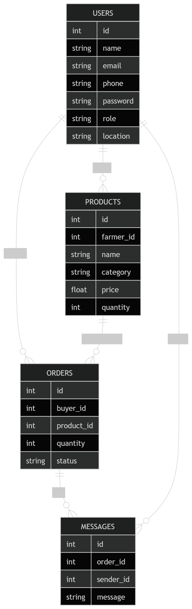

# AgriSpark

AgriSpark is an Expo + React Native app that connects farmers and bulk buyers for direct produce transactions. It includes separate farmer and buyer experiences, Supabase-backed authentication, product management, orders, and profile flows.

## What It Does

- Farmer onboarding and authentication
- Buyer and farmer dashboards built with Expo Router
- Farmer product creation, editing, and deletion
- Buyer product browsing and order placement
- Order tracking on both farmer and buyer sides
- Password reset, profile management, settings, and logout
- Supabase connection test screen for local verification
- Landing page sections for product discovery, guidance, testimonials, and featured items

## Tech Stack

- Frontend: React Native, Expo, Expo Router
- Language: TypeScript
- Backend and auth: Supabase

## Farmer Dashboard

The farmer dashboard is the main control panel for farm activity. It gives farmers a quick view of their business and actions from one screen.

- Welcome banner with the farmer name and location
- Farm snapshot cards for active listings, orders today, stock value, and low stock items
- Recent products list with image previews and stock status labels
- Quick access to create listings, view orders, open chat, and manage products through the bottom tabs

## Getting Started

1. Install dependencies:

```bash
npm install
```

2. Create a local `.env` file from `.env.example` and set the Supabase values:

```bash
EXPO_PUBLIC_SUPABASE_URL=your_supabase_url
EXPO_PUBLIC_SUPABASE_PUBLISHABLE_KEY=your_supabase_publishable_key
```

3. Start the development server:

```bash
npm run start
```

Useful scripts:

- `npm run android`
- `npm run ios`
- `npm run web`
- `npm run lint`

## Docker Web Build

The repository includes a Docker setup that builds the Expo web app and serves it with Nginx.

Build and run with Docker Compose:

```bash
docker compose up --build
```

Then open `http://localhost:8080`.

If you prefer a direct build, pass the same Supabase variables as build args:

```bash
docker build \
	--build-arg EXPO_PUBLIC_SUPABASE_URL=$EXPO_PUBLIC_SUPABASE_URL \
	--build-arg EXPO_PUBLIC_SUPABASE_PUBLISHABLE_KEY=$EXPO_PUBLIC_SUPABASE_PUBLISHABLE_KEY \
	-t agrispark-web .
```

## System Flows

### Authentication Flow


### Buyer Browsing and Ordering Flow


### Farmer Product Management Flow


### Order Management Flow (Farmer Side)
.png)

### Full System End-to-End Flow


### Visual Design


<!-- I'll add the rest -->


